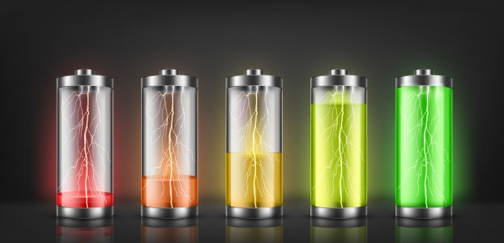

# UPS-Monitoring-System

html code

<!DOCTYPE html>
<html>
<head>
	<title>UPS Back Up Time Estimator</title>
	<link rel="stylesheet" type="text/css" href="https://maxcdn.bootstrapcdn.com/bootstrap/3.3.5/css/bootstrap.min.css">
	<link rel="stylesheet" type="text/css" href="ups.css">
	<link rel="stylesheet" href="https://use.fontawesome.com/releases/v5.11.2/css/all.css">
</head>
<body onload="displayText()">

	<!--  -->
	

	
	<h1 style="color:white">                  FYI</h1>
	
	<h4 style="color:white">.   The Power Rating of a Fan is 75W in general</h4>
    <h4 style="color:white">.   The Power Rating of a Tube Light is 55W in general</h4>
    <h4 style="color:white">.   Inverter Efficiency is 0.8(approx)</h4>
	<h4 style="color:white">.   Battery Capacity ranges from 120Ah to 200Ah</h4>
	
.

	
	

	   

		<h1>UPS Back Up Time Calculator</h1>
		
Give the asked details and get the time remaining.

	   

	

	

		
. 

		
. 

		<h2 style="color:white">
 TARP 
</h2>
		
 .

		
 .

		<h3 style="color:white">
© Developed By
</h3>
		
VB Yashwanth Rao

		
Subramanian Venkatachalam

		
Thirumeni Ram

		
Ganesh Ram

		
	

</body>
</html>

CSS Code:

body {
	background-color: black;
      
}

#bottom-stuff {
    padding: 0px 30px 30px 30px;
    margin-left:300px;
    position: relative;
}

#bottom{

    position: absolute; bottom: 0px; 
}

#img{
	background-size: 50%;
}

JavaScript File:

window.setTimeout(function() {
  // your code here
	

var cap = prompt("Enter battery capacity in AH");
var cap = parseInt(cap);
var volt = prompt("Enter VOLTAGE RATING OF THE BATTERY");
var volt = parseInt(volt);
var n = prompt("Enter number of devices");
var n = parseInt(n);
var p=0;
var c=0;

for (var i = 1; i <= n; i++) {
	c=prompt("Enter the POWER RATING of device "+ i);
	var c = parseInt(c);
	p = p+c;
}

alert("Total power consumption is " +p+ " W");

var time = (0.8*volt*cap)/p;

function time_convert(num)
 {
  num = num*60; 
  var hours = Math.floor(num / 60);  
  var minutes = Math.floor(num % 60);
  return hours + " hours and " + minutes+ " minutes";
          
}

alert("The estimated remaining time is "+time_convert(time));

}, 500);

